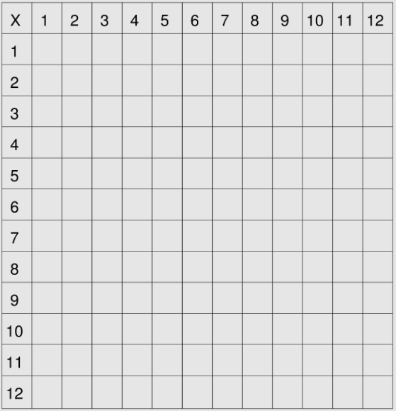

# Memory

In this lesson we're gonna be covering the concept of memory. This may be tiring to listen to but bear with it one more time, so data structures are the foundational knowledge that you need to tackle coding interview problems, and complexity analysis is the foundational knowledge needed to better understand data structures, but there is one more layer of foundational knowledge that is a must-to know for really understand both complexity analysis and data structures, and that's why we're talking about memory here.

Once you finish this lesson, a little switch will be flip in your mind and you'll have a lot more clarity around how things work under the hood when you write and execute code. You will comprehend why it works the way it does, and this in turn will help you understand why data structures work the way they do, and why they have certain complexity ramifications, and so on and so forth. But before we dive into what memory is, accept this caveat which is that we could talk about memory for hours, there is plenty of content that fills a entire course about it, is a very large topic area, and many computer science topis relates to this area, but this lesson it's dedicated to simplifying some concepts relevant to memory that matters in the context of coding interviews. Enough preamble, let's actually dive into our lesson.

When you write code, and when you execute code, one of the most basic things that you do is declaring variables so then you use those variables later on your code. For instance you may have the variable `bar` and assign the value `2` for this variable. You might conceive the idea that behind the scenes, somewhere in your computer or through your program, this variable `bar` has to be stored because we're going to be referencing this variable later on the code. This is where memory comes into play.

So what is memory? How do you think of memory? You can think of it in many different ways, but here we're using a simple canvas.



This canvas lives somewhere in your computer that is bounded, and divided in a bunch of little slots. Keep in mind this a bounded canvas meaning there is a finite number of slots, and when I say slots actually I'm referring to memory slots because we gonna be storing stuff in them. Why does it matter that this is a bounded canvas? Well you should remember the previous lesson where we talked about space complexity where we say that the less memory an algorithm takes up, the better it is right? And that's precisely because this memory canvas is bounded, it has a finite number of memory slots. You can imagine if all these memory slots were taken up, that's mean they are fully occupied, you would no longer have any available memory slots, therefore you would want an algorithm to take up less memory, that means it takes fewer memory slots.

Okay, so when we declared `bar = 2;` in our code, what happens under the hood when you run the code is that your program is going to store this variable, namely the number two in a memory slot. And the program could alocate this variable at any available slot, so if you run it for the first time, let's say the variable is saved for reference on slot at coordinates (3,4) but maybe the second time you run it this slots is no longer available, and the variable is stored on another vacant slot, let's say (6,2).

How your computer picks where and when alocate memory slots is beyond the scope of this lesson. What you should stick in mind is that your program will always store a variable in a memory slot or in a series of memory slots that's is unoccupied. The second thing to note is that if your program for whatever reason, needed more than one memory block to store information, it would allocate it in back-to-back memory slots.

Let's take a more atentious look at how the value assigned to the variable `bar` is actually stored, or represented under the hood, in the memory slot before we back to this idea of back-to-back memory slots when multiple memory slots are needed.

So when we allocate the number 2 to the slot at coordinates (3,4) that time, how is memory actually represented? What's the unit that we use for memory? Well it turns out that memory is made up of just what are called **bits**. Bits are zeros and ones.

```
00101
```

Those above are bits, and that's what memory looks like because, as a matter of fact, your computer only understands zeros and ones. When we store data in a memory slot, we actually store that data in the form of bits and, more specifically, each memory slot can hold up to eight bits. The set of eight bits is what's so called a **byte** as shown below.

```
00010101 00001101 01000001
```

So when you store data in a memory slot, you actually store a byte of data, eight bits. But wait a minute, if our memory slots only can handle zeros and ones, how our variable `bar` is stored then? Well, turns out that behind the curtains what happens is a binary conversion so numbers, strings, and files, can be represented as binary numbers, that are numbers that is in the base two system. On base two system the rightmost bit represents two to the power of zero (2^0), the second rightmost bit represents two to the power of one (2^1), then to the power of two (2^2), and so on and so forth.

Now if you're paying close attention, you may be wondering that with one byte, with is eight bits, we don't have that many combinations of zeros and ones, fells that we cannot store a wide diversity of data with just one byte, and that's correct. One byte isn't enough because it only tolerates two to the power of eight (2^8) potential data values that we can represent, and that is precisely 256-bits. So how could we represent more data values, what happens if we change the value of our variable as follow: `bar = 257;`. Well basically what we need to do is increase the number of bits, and that's pretty much all we've to do. So when 8 bits aren't enough we allocate 16 bits, then if more bits are needed we allocate 32 bits, or even 64. Have you ever heard about 64 bit integers or 32 bit integers? Well that's because a lot of computer architectures or in a lot of programming languages, we represent integers either on 32bit format or 64bit format. If you ahve a C++ or Java background, you should know that a `int` data type represents a 32bit integer, whereas a `long` data type represents a 64bit integer, and when you're coding on these languages when you store a `int` on a memory slot, you're reserving 32bits of space in that slot to store you data, and that's equals to 4 bytes by the way, so if each memory slot can hold up to 8 bits which is the same as 1 byte, then this `int` variable would occupy 4 memory slots, the same way that a `long` variable would always occupy 8 memory slots, no matter the value assigned to it.

So recapping what we've saw at beginning, not only we need a free memory slot, to store data, but a back-to-back contiguous free memory slots if you're gonna need multiple memory slots. Now, does the order matters of how we place these bits on memory slots? For that you should take a look about a concept called **endianness**:

> Endianness means that the bytes in computer memory are read in a certain order. 

You can check out more detailed explanation about it on [this video](https://www.youtube.com/watch?v=NcaiHcBvDR4)

So by now you should stick in mind that the number of memory slots you're gonna be using for your integers is always a constant, it does not increase as your integer increases. If you decided to stick with a 64bit integer, it will always take eight memory slots during the lifecycle of your program.

Now for the reason why the grass is green, we now want to change our variable to a list of numbers, so now `bar = [1,2,3];`. Well this list gonna be stored in almost the same way that a single number is stored, with the difference that each memory slot would be chained representing so the order of values defined on the list. In this case `bar` will have to consume 12 bytes, that means 12 back-to-back free memory slots.

And you must be asking yourself, but how do strings are stored into memory slots? They are very common in coding, so common that now urges the need for us to declare a new variable `foo = "moon";`. Well we're going to have a dedicated lesson about strings but, by now, what you have to know is that a string is no more than an array of characters, and each character can actually be maped to a binary number. So the same way a list of numbers are stored in a back-to-back memory slots, the same happens to the way that a string is stored.

Another very, very important concept that you should be aware of is regarding to **pointers**. So far, we've only stored in our memory slots data that we said had been declared in our code with variables. It turns out, we don't only have to store that type of data in our memory slots, we could actually store, if we wanted to, the number of another memory slot, this number is also referred as **memory address**. Memory addresses are also represented in a binary format. The idea with pointers is to store on a specific memory slot, a reference to the value store on another memory slot. For what that would be useful for, you may ask, well the beauty on pointers is that unlike lists, or strings, that are stored on a back-to-back memory slots, we can refer to a memory slot that is far away from our actual memory slot.
