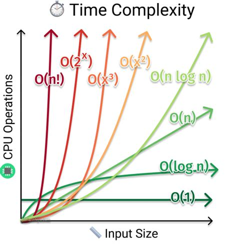

# Big O Notation

This lessons will cover the Big O Notation, more specifically, we're gonna be looking at how exactly we measure complexity, and we're gonna be looking at the notation that we use to describe complexity in algorithms. On top of that, we're gonna be going through a few practical techniques that you can use in your coding interviews to determine the complexity of your algorithms.

So if you remember from the complexity analysis lesson, we learn that time complexity measures how fast an algorithm runs, and space complexity measures how much auxiliary memory it takes up. So what does this really mean? Take time complexity for example, if you have an algorithm, how would you express that algorithm's time complexity? Would you say that the algorithm has a time complexity of 5 seconds, or 100 miliseconds? No, you wouldn't say that, because in fact that just don't have much meaning, it's just not very valuable. Another considerations you may take in account is that Big O notation helps us answer the question: “Will it scale?”, and also equips us with a shared language for discussing performance with other developers (and mathematicians!).

The pseudocode below shows three different algorithms, `f1`, `f2`, and `f3`. All of them take in an array as an input, here you can assume this is an non-empty array of integers. The first algorithm just returns the sum of the first element on the array plus one. The second algorithm just sums up every elements in the array. The third algorithm generates a bunch of pairs of numbers in the array, so for a given array `[1, 2, 3]`, it will produces the pairs `{1,1}, {1,2}, {1,3}, {2,1}, {2,2}, {2,3}, {3,1}, {3,2}, {3,3}`, because it traverses the array over and over for each element.

```javascript
a = [...]; //N-length

f1(a) => 1 + a[0];
f2(a) => sum(a);
f3(a) => pair(a);
```

Now let's actually express their time complexity and use what was said before about expressing the time complexity in seconds or miliseconds. So to do that what would you do is actually implement these algorithms on the language of your choice, using or not a library, and them track how long it takes to execute these three algorithms.

So first you start with an array of length equal to one, so that our array has only one element. When running all the three algorithms with that array, they would all run basically instantly, but if you're actually tracking the execution time of the algorithms, you might get slightly different values every time, even for the same algorithm. And the reason for this behaviour is that beyond the execution of the program, a lot of other process and routines are happen on the machine and they affect the execution time performance. But the takeway for this example is that for one-length array, these 3 algorithms will run very fast.

Now if you take the same algorithms to run with an array with length of 1,000, you would problably start to see something a little bit different. The first algorithm wouldn't change, it will run just as fast from the first time. The second algorithm would also run pretty much fast, with a slightly variation compared to the first time. But the third algorithm would start taking a few seconds more though. And then if you were increasing the size of the array, for let's say 10,000,000 elements, the first algorithm will have almost the same execution time, the second one will start taking a few seconds more, and the third one will likely run for a very, very long time, and probably will crash before perform the task completely.

Notice how is basically impossible to describe the time complexity of these algorithms in seconds, or miliseconds, because it really just don't make sense. Clearly we saw that depending on the size of the input array, these algorithms might all run at almost the same speed when lenght equals to one, but when we start increasing the lenght then their speed starts to differ. It’s difficult to identify an algorithm’s exact runtime. It is dependent on the CPU speed, as well as what else is operating on the computer. So, rather than discussing the runtime exactly, we use Big O Notation to discuss how rapidly the runtime rises.

It's more meaningful to describe the time complexity of those algorithms by saying that they are affected by the size of the input, and as the size of the input grows they are affected more and more, `f3` really is the most sensible algorithm to the size of the array, whereas `f2` is affected also but not that much, and finally `f1` isn't affected at all. That's much more meaningful than to try giving this weird arbitrary seconds, or miliseconds, based on range of input sizes.

Space complexity is essentially equivalent to time complexity in how we measure it, with Big O Notation. The definition to these both complexity measures could be said as the measure of the algorithm speed or the algorithm memory allocation as the size of the input to this algorithm increases. How much it performs as the size of the input grows.

So let's start using Big O Notation to measure our algorithms. `f1` we would say that it has a time complexity of `O(1)` (O of 1), and it can be read as a constant time complexity, we're saying that as the size of the input increases, the speed of `f1` remains constant, hence constant time `O(1)`. `f2` the time complexity would be `O(N)` (O of N), which can be read as linear time complexity, and means that as the size input increases, the speed of the algorithm increases linearly. `f3` has a time complexity of `O(N^2)` (O of N square), because for every element in the array we have to iterate the whole collection, thus N times N.

Let's take a step back and really study this Big O Notation. So in english terms, we've said that with time complexity we're measuring the changing speed of an algorithm with respect to the size of the input, right? There is actually a mathematical term for that, it used for analyzing the behaviour of a function as input of the input increases and tends towards a value, for instance infinity, that's the so called **asymptotic analysis**. It basically means the study of the behavior of some function `f(N)` as the value of N tends towards infinity. Basically when dealing with time-space complexity we're expressing these concepts asymptotically using the Big O Notation.

## Fundamental Categories of Complexities and O Notation



- Constant Complexity: *O(1)*

    If an algorithm takes the same amount of time regardless of the number of inputs, it is said to have constant time complexity

- Logarithmic Complexity: *O(log n)*

    When the time decreases at a magnitude inversely proportional to N at each successive step in the algorithm, Logarithmic Time Complexity O(log n) happens. This is common in the Binary Search Algorithm.

- Linear Complexity: *O(n)*

    Linear Time Complexity refers to the complexity of an algorithm or program that grows in direct proportion to the quantity of the input data. In circumstances where the algorithm must read its full input sequentially, linear time is the best feasible time complexity.

- Log-Linear or Quasi-Linear Complexity: *O(n log n)*

    Linear Time Complexity refers to the complexity of an algorithm or program that grows in direct proportion to the quantity of the input data. In circumstances where the algorithm must read its full input sequentially, linear time is the best feasible time complexity.

- Quadratic Complexity: *O(N²)*

    The performance of a quadratic time complexity method is directly proportional to the squared size of the input data collection (think of Linear but squared). This time complexity will appear in our applications anytime we nested numerous iterations within data sets. But depending on the algorithm it could be cubic, quartic, quintic, etc.

- Exponential Complexity: *O(2^n)*

    An algorithm with exponential time complexity doubles in size with each addition to the input data set. The time complexity begins with a lower level of difficulty and gradually increases till the conclusion.

- Factorial Complexity: *O(n!)*

    If Big O assists us in identifying the worst-case situation for our algorithms, then O(n!) is the worst of the worst. Remember that a factorial is the product of an n-integer sequence.

Keep in mind that when we refer to Big O Notation we're referring to the worst case scenario.

## Examples

Now we're gonna explore a few basic examples and see how to apply some techniques to figure out the complexity of some algorithm.

Does your algorithm perform elementary operations like arithmetics, needs to declare some auxiliary variables maybe accessing an external source, or works with a fixed-size array length along the entire process? Must probably that the complexity notation for this algorithm is **O(1)** because the resources expended during runtime doesn't have much to do with the input size lenght but really with the implementation of the algorithm.

Does your algorithm traverses through an array and at every element it just updates some reference, maybe to populate a new collection or even mutate the original array? Must probably that the complexity notation for this algorithm is **O(N)**, the resources expended scalates in a direct proportion as the input size increases.

Does you algorithm takes two or more inputs, like two different arrays and loop through them? In that scenario the complexity notation for this function could be denoted as **O(M + N)** meaning a linear complexity reflects the total size of both inputs. And if this algorithm traverses the first array for every element inside the second array you may denote the complexity as **O(M^2 + N)**.

See how complexity notations can be combined to denote exactly how an algorithm behaves.
