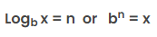

# Logarithm 

In this session we're going to be covering the logarithm, and more specifically, we're going to have a deep understanding of what the expression `log(N)` means in the context of complexity analysis.

Logarithm, or simply `log(N)`, is an incredibly important concept in algorithm analysis, thus it's important in coding interviews, it appears very frequently and candidates are often very scare of it. The reason candidates are scared of them is because:

1. It looks very math related (guess what, it is).
2. They don't really grasp what does it mean, the intuition behind it.

## The math behind logarithm

This is the definition of logarithm: 



We say that the logarithm `log`, of some number `x`, given a base `b` is equal to `n` if, and only if, `b` to the power of `n` is equal to `x`.

Fist important thing to notice when talking about logarithm in complexity analysis, is that we need to specify a __base__.

If we denote `log` at base `3` of number `10` and `log` at base `10` of number `10`, we're going to get very different results. This is where you have to realize that in computer science, and in coding interviews, when we talk about `log(N)` we always assume that the base is equal to `2`, that's the so-called __binary logarithm__. So the logarithm `log`, of some number `x`, given a base `2` is equal to `n` if, and only if, `2` to the power of `n` is equal to `x`.

When talking about computer science and coding interviews, when the base is omitted, the default base is `2`. That's may confuse some of you because, in a matter of fact the default base is always `10` in math. But here we deal with binary systems, hence is more logical to assume that the default base is `2`.

And what the definition of the logarithm implies? Basically that `log(N)` is the power of `2` to get `N`. It's actually not that difficult of an equation to reason about. For instance, this means that `log(1)` is equal to `0` and `log(2)` is equal to `1` because `2` to the power of `0` is equal to `1` and `2` to the power of `1` is equal to `2`.

```javascript
log(N) = ?
2 ** ? = N
where ? equals to log(N)
```

## The intuition behind logarithm

Let's look at powers of `2`, when we increase a power of two we're doubling whatever number we previously had.

```javascript
log(N) = ?
2 ** ? = N
2 ** (? + 1) = 2N 
```

As `N` doubles, the `?` increases by one. The more `N` increases, the value of `?` increases by a tiny amount. This relation tells us what `log(N)` really represents, the `log(N)` increases only by a tiny amount as `N` increases, so when `N` doubles, the `log(N)` only increments by one.

This is why if we tie back to complexity analysis, when we have an algorithm with a time complexity of `log(N)`, that is incredibly good, because that means that as the input increases, so as the input doubles, the number of elementary operations that we're performing in the algorithm only increases by one.

So, you can start to realize that a `log(N)` complexity is exceedingly better than a linear complexity. Even though `O(N)` is already pretty good for an algorithm, `O(log(N))` is going to be way better as the size of your input increases. The complexity of `O(log(N))` really represents a complexity that does not increase fast as the size of the input increases.

## Examples

Imagine you have an array of length `N`, your algorithm takes a bunch of steps, but at every step it eliminated half of the array. So the very first step cuts the array in a half, discarding the elements of the other half, then moves to the next step and cuts the array in half again, discarding the elements of the other half, and so on. In total the amount of operations that we performed with this algorithm, on our original array, is basically equal to `log(N)`.

You can think of algorithms that have a time complexity of `log(N)` either by asking yourself - "Am I eliminating half of the input at every step of my function?", if yes, then you're likely dealing with the `O(log(N))` time complexity assuming you're not performing auxiliary operations at every step. And similarly you can ask yourself - "If I double the size of my input, am I only going to be performing one extra operation?".

## Conclusion

That was the logarithm and how it relates to computer science and coding interviews. Hope that you're now no longer afraid of the concept of `log(N)`.
