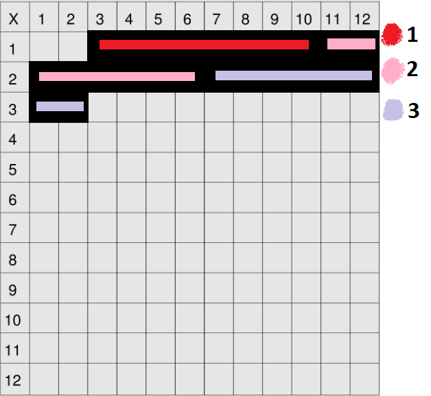

# Arrays

Arrays are one of most fundamental, perhaps the most, data structure of all and you most probably had interacted with them before. If you've done any kind of coding, you've likely declared or manipulated an array or list (they're the same thing).

Here we're going to be looking at arrays in detail, how they work under the hood (that's going to be enlightening for some of you), we're going to explain why certain things that we take for granted about arrays work the way they do, and we're going to make sure that we're on the same page in regard to all the operations, and functions that you can perform on an array or with it, as well as their space-time complexity implications.

So on that note, let's look how arrays are store in memory. Remember that how we used a canvas illustration to represent the computer memory?


We've got this bounded memory canvas with a bunch of memory slots. Each slot holds a byte which is eight bits, a binary number of 8 bits. And if we want to store an array or a list of any stuff, like integers:

```javascript
[1,2,3]
```

Then our operating system would transform all of these integers into their binary number format. Let's say that we're dealing with a 64-bit architecture system, then our operating system is going into the memory canvas, find a series of back to back memory slots that are free that have enough space to allocate or hold 3 integers. So if those integers are 64-bit integers, that means that they each take 8 bytes or 8 memory slots, so we need `8 * 3` memory slots, equals to 24 memory slots back to back, that don't have anything in them.

So far we're just reiterating what we saw in the previous memory lesson. We fill the slots that are going to be taken up by our array, and let's make clear that the first integer is store from memory slot `(3, 1)` till `(10, 1)`, the second integer is stored from memory slot `(11, 1)` till `(6, 2)`, and the third integer is stored from memory slot `(7, 2)` till `(2, 3)`.



This is what happens under the hood. The operating system didn't just randomly allocated free slots for the array, pay attention that the number of memory slots is directly linked to the length of the array.

There are actually two types of arrays: **dynamic** and **static**. Let's start the discussion exploring the array we used in the previous demonstration, it has a fixed number of memory slots, so that's an example of a static array.

When coding in C++ or Java, you would typically declare it like so:

```java
int[] myIntArray = {1, 2, 3};
```

The declaration above explicitly instructs the operating system that we need to allocate 3 integers, which means 24 memory slots. Why does that matter? Because if you didn't specify the length of the array, then the operating system wouldn't know. That means the OS would try to allocate an infinite amount of back to back memory slots? No, that wouldn't make sense because then you would run out of memory really fast. That's the idea behind a static array, after specifying the length of the array, the OS will only allocate the equivalent memory slots to it and that's it, it'll never change.

Before we explore the concept of dynamic arrays let's just assume that all arrays are always static. What are some of the common operations that we want to perform on an array? Most likely being to read a value at a given index in an array, and the syntax for doing so will be similar to this:

```javascript
myArray[index]
```

Accessing an element in an array at a given index is a very basic operation that is performed almost instantly. What does *instantly* really mean? This is where our new knowledge about complexity analysis and big O notation comes into play.

When we say that accessing an element at an array is instant, it means that it runs in constant time, it never changes regardless of how big the array is. Getting back to the canvas, when our operating system stored the array, it knew the memory address where the array starts, and also that the array contain fixed width integers, which implies it never changes therefore it is a constant. All that's really happening behind the scenes, is our OS finding the memory address where the array starts, counting how many memory slots each element takes up, and matching the given index with the start of the memory slot of the corresponding element, always dealing with arithmetic operations on binary numbers at a constant time operation. Having that said, accessing an element in an array has `O(1)` space-time complexity, the operation to retrieve happens at constant time and no additional memory is required for doing so.

Now what about some other operation that's similar to get an element in an array, *set* an element in an array, which means to overwrite and element at a given index, and the syntax for doing so will be similar to this:

```javascript
myArray[index] = value;
```

This operation is really as similar as the previous one. The operating system knows exactly where the memory address of the element at the given index is, then it basically swaps new binary numbers with old binary number, and it also knows it has a fixed amount of binary numbers. So setting an element in an array also going to be constant time and constant space, so it's also `O(1)`.

And how can we denote the space-time complexity when we initialize the array? Well it's going to be `O(N)`, where `N` is the length of the array, and as `N` increases so the initialization time and necessary memory increases linearly.

Let's explore another common operation that we want to perform on an array: traversing an array, you can think of it as a __for loop__. Well if the OS has to traverse every memory slot of the array and without performing any additional operation, then it's going to be `O(N)` time complexity but still `O(1)` space complexity (time takes up as `N` increases but the amount of memory it takes remains constant). So that common operations you do when traversing arrays such as `map`, `filter`, `reduce`, all of those built-in array functions going to be `O(N)` time complexity and `O(1)` space complexity.

But what about copy? We often copy arrays right? Well that's also going to be denoted as `O(N)` space-time complexity, because first we traverse the original array reading all elements it has just to allocate the same amount of memory slots for a new array.

Let's move on and talk about the insertion, the *add* method. When we use *set* we're talking about overwritten an already existing element, but when we use *add* we're talking about inserting a new element in whatever position in the array, it could be in the beginning, the middle, or the end. Well the insert operation is really a pretty bad operation, think about it for a moment: we have our original array with 3 elements on it, and for some reason we need to insert a fourth element in the middle of it, we're basically telling the operating system to somehow shift all memory slots that are after the new element to the right.

Well that's raise a problem because we're dealing with a static array which has fixed length, what if the memory slots at the right are occupied with some other information? See? It's not just adjusting the elements order, it also needs to check if there is available space for the new element. What options do we have to solve that? Well, the fact is that the OS copy the entire array to a new available memory location where there are enough memory slots for the new element. So whenever you try to *add* something to an array, whether it be at the very beginning, the middle, or at the end, under the hood what really happens is a *copy* operation of the entire array. Thus, the insert operation is going to be denoted as `O(N)` time complexity and `O(1)` space complexity because we're copying each element of the array but taking almost the same amount of memory and the old memory slots are freed up.

Dynamic arrays work slight different allowing us to have more efficiency by allocating twice as more memory needed so you can freely append new stuff to it making it much faster. Once you reach the maximum of that array space the OS will *copy* it to another array and then double it again! That give us the time-space complexity of `O(2N)` when we're doing amortized analysis.

```javascript
static = [1, 2, 3]
```

```javascript
dynamic = [1, 2, 3, _, _, _]
```

Well and you remove some element of an array that's for sure `O(1)` time-space complexity when you mean to remove the last element of the array! If you attempt to remove the first element of the array or the element at index **z**, then you end up with a `O(N)` time complexity because you have to shift all the elements after the one you're trying to remove to the left.

## Resume

- Array
    
    A linear collection of data values that are accessible at numbered indices, starting at index 0.

The following are an array's standard operations and their corresponding time complexities:

- Accessing a value at a given index: **O(1)**
- Updating a value at a given index: **O(1)**
- Inserting a value at the beginning: **O(n)**
- Inserting a value in the middle: **O(n)**
- Inserting a value at the end:
    - amortized **O(1)** when dealing with a dynamic array
    - **O(n)** when dealing with a static array
- Removing a value at the beginning: **O(n)**
- Removing a value in the middle: **O(n)**
- Removing a value at the end: **O(1)**
- Copying the array: **O(n)**

A static array is an implementation of an array that allocates a fixed amount of memory to be used for storing the array's values. Appending values to the array therefore involves copying the entire array and allocating new memory for it, accounting for the extra space needed for the newly appended value. This is a linear-time operation.

A dynamic array is an implementation of an array that preemptively allocates double the amount of memory needed to store the array's values. Appending values to the array is a constant-time operation until the allocated memory is filled up, at which point the array is copied and double the memory is once again allocated for it. This implementation leads to an amortized constant-time insertion-at-end operation.

A lot of popular programming languages like JavaScript and Python implement arrays as dynamic arrays.
